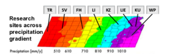

# Visualizing Groundwater Variation Across KS

**Name**: Bre Waterman  
**Semester**: Spring 2019  
**Project area**: Hydrogeology

## Objectives
I aim to construct code using python that will allow for production of quality figures that will show the spatial variation of groundwater levels across the state using data extracted from USGS. 

## Outcomes
The goal for this code is to be able to process .gz data files extracted from USGS, calculate averages of groundwater levels from (**past ten years**) within the precipitation bands (lat./long. coordinates are already known), and output a figure that displays the averages within the bands across KS.

## Background
The idea for proposed code stems from the Microbiome of Aquatic ecosystems, Plants and Soils (MAPS) figure located below, where the state of Kansas has been divided into bands based on average precipitation amounts. Being able to construct a similar figure with data on groundwater levels projected across the section of Kansas in a similar fashion would be beneficial towards visualizing groundwater variations across the state. 

## Sketch
Data extraction from USGS database > Import .gz data files > Code computes averages of gw levels within each band > output summary .csv file and/or figure (**make sketch and add image to repository**).

 
### Changes
 * Clarify the time resolution of the average values for groundwater - average over the past 20/30 years?
 * Make better, more specifc sketch

start with one well over time, averages and then apply to region, once figured out then apply to region then apply to transect
