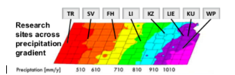

# Visualizing Groundwater Variation Across KS

**Name**: Bre Waterman  
**Semester**: Spring 2019  
**Project area**: Hydrogeology

## Objectives
I aim to construct code using python that will allow for production of quality figures that will show the spatial variation of groundwater levels across the state using data extracted from USGS. 

## Outcomes
The goal for this code is to be able to process .gz data files extracted from USGS, calculate averages of groundwater levels from (**past ten years**) within the precipitation bands for which I already have the coordinates for, and output a figure that displays the averages within the bands across KS.

## Background
The idea for my proposed code stems from the MAPS figure (**Add image below (safe it to my desktop and add - see andres examples**), where the state of Kansas has been divided into bands based on precipitation amounts. Being able to construct a similar figure with data on groundwater levels projected across Kansas in a similar fashion would be beneficial towards visualizing groundwater variations across the state. 

## Sketch
Data extraction/collection > Import data files into bands > Construct python code to compute averages of varaible within each band > output figure (**make sketch and safe, add image to this page - see andres sketch**).

 
### Changes
 * Clarify the time resolution of the average values for groundwater (daily, monthly, annually) - average over the years
 * Implement the project proposal in Markdown and push it to your repository.
 * Make better, more specifc sketch
